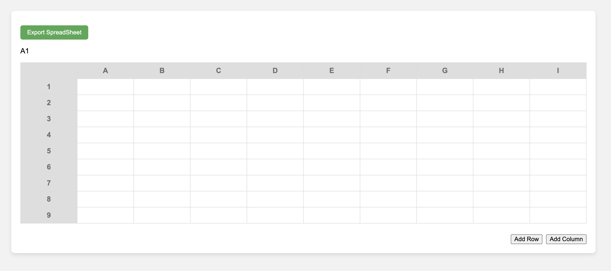

# 📊 Simple SpreadSheet 📝

간단한 웹 기반의 스프레드시트 어플리케이션입니다. 기본적인 셀 편집 및 데이터의 CSV 형식으로 추출하는 기능을 포함하고 있습니다.

## 🌟 주요 기능

### 1️⃣ 파일 추출 기능 📁
- **작동 원리**: 테이블 내의 데이터를 CSV 형식으로 변환한 뒤, 사용자의 컴퓨터에 `.csv` 파일로 다운로드합니다.
- **코드 설명**: 
  ```javascript
  document.getElementById('exportBtn').addEventListener('click', function() {
      const table = document.getElementById('spreadsheetTable');
      let csv = [];
      //... (이하 코드 생략)
      const a = document.createElement('a');
      a.href = URL.createObjectURL(blob);
      a.download = 'spreadsheet.csv';
      document.body.appendChild(a);
      a.click();
      document.body.removeChild(a);
  });
  ```

---

### 2️⃣ 셀의 행과 열 위치 표시 🚩
- **작동 원리**: 셀을 클릭하면 해당 셀의 행과 열 위치를 왼쪽 상단에 표시합니다.
- **코드 설명**: 
  ```javascript
  document.getElementById('spreadsheetTable').addEventListener('click', function(e) {
      if (e.target.tagName === 'TD') {
          const rowIndex = e.target.parentNode.rowIndex;
          const colIndex = e.target.cellIndex;
          const colLabel = String.fromCharCode(64 + colIndex);
          document.getElementById('currentPosition').innerText = colLabel + rowIndex;
          //... (이하 코드 생략)
      }
  });
  ```

---

### 3️⃣ 행과 열 추가 기능 ➕
- **작동 원리**: "Add Row" 버튼을 누르면 행이, "Add Column" 버튼을 누르면 열이 추가됩니다.
- **코드 설명**: 
  ```javascript
  function addRow() {
      const table = document.getElementById('spreadsheetTable');
      //... (이하 코드 생략)
  }
  function addColumn() {
      const table = document.getElementById('spreadsheetTable');
      //... (이하 코드 생략)
  }
  ```

---

## 🖥️ 구현화면

---
<br>

[웹 사이트 미리보기](https://fabulous-frangollo-44384f.netlify.app/)

